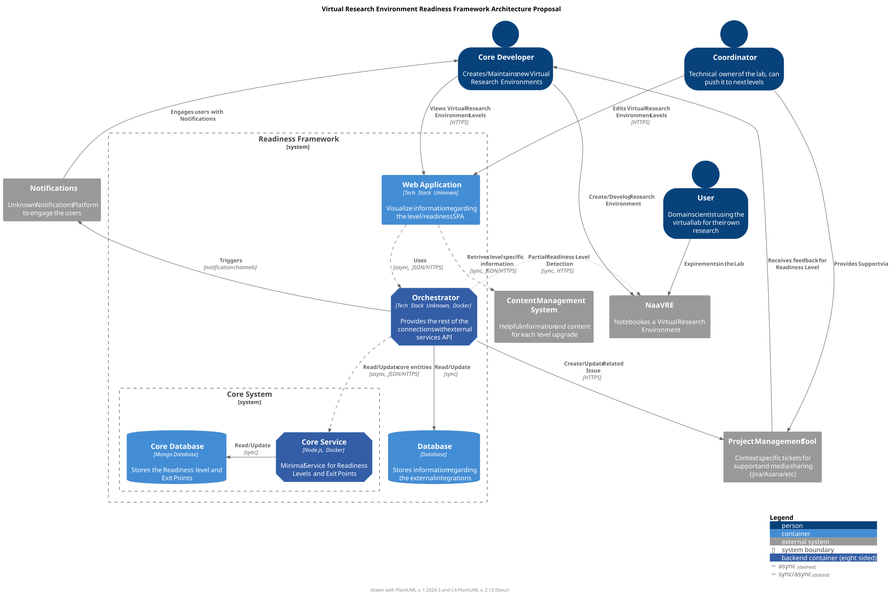

# Virtual Research Lab Readiness Level Framework
:sectnumlevels: 4
:toclevels: 4
:sectnums: 4
:toc: left
:icons: font
:toc-title: Table of contents

*Document status* :  DRAFT

*Last modified* : {docdate} 

This repo is a set of documents that describe a management framework for Virtual Research Labs (VRL).

Below there are links to usefull sources and links to the remaining documents.
====
    This document is part of thesis project for the UvA (University Of Amsterdam).
====

## Virtual Research Environments
A virtual research environment (VRE) or virtual laboratory is an online system helping researchers collaborate.

### Relevant Sources
- https://naavre.net/[NaaVRE]
- https://naavre.net/docs/readiness_levels/[Readiness Framework]
- https://github.com/NaaVRE/NaaVRE/issues/18[GitHub Issue]

## Scope

### Vision
_TODO_ 

### Context
_TODO_ 

### Goals
_TODO_ 

## Architecture
### Overview

### Proposed Components

- link:lab_repository.adoc[Lab Repository]
- Progress Detection Tool
- Project Management Tools
- Engagement Solutions

