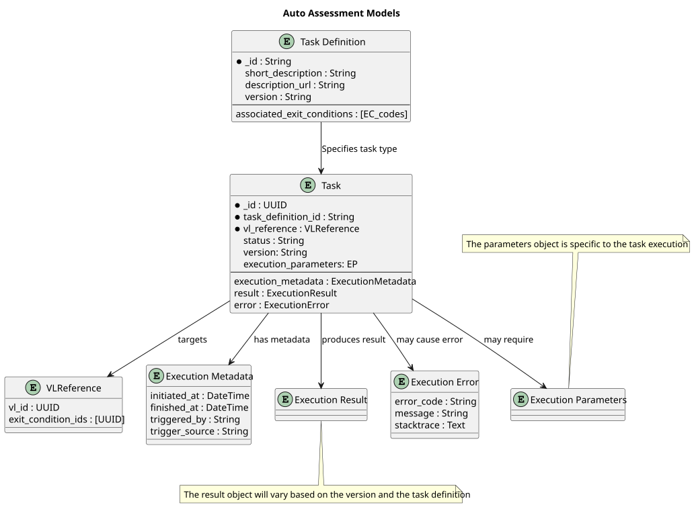

# Auto Assessment Component
:sectnumlevels: 4
:toclevels: 4
:sectnums: 4
:toc: left
:icons: font
:toc-title: Table of contents

*Last modified* : {docdate} 

*Document status* :  DRAFT

## Introduction

This document describes a component of the framework that automates the assessment of various quality metrics regarding the VL quality and readiness.

### Scope
Many of the exit conditions that act as quality properties for the Virtual Labs are subjective to human standards and they don't have an easy way to verify their quality. For Example the following exit 
condition.
[TIP]
 E.g. "The virtual lab has a nice name."

Other Exit Conditions can be deterministically assessed regarding their status. 

[TIP]
E.g. The codebase repository has version control (e.g. git)

====
The scope of this component is to provide the foundations to create several tasks that will gather metrics and deduct the overall progress of an Exit Condition. 

The development of new metrics for the assessment of the quality of the VL is not part of this component.
====

## Entities
This component introduces new entities that model the proposed processes. 

### Tasks 
A task represents a generic procedure that generates an outcome which will be used to indicate the progress of one or several Exit Conditions.

#### Definition
A task definition is a record that links the itended behaviour of a task with the executable code and references the past executed tasks. 

#### Executable Task
This entity represents the outcome of a task execution. It has to be linked with a task definition. It should also contain several objects such as the result of the execution (specific), the error (if it failed), the version of the executable, and reference to the VL.

#### Exit Condition Relation 
A task definition includes a reference to one or many exit conditions. The task's outcome varies on the task type and on the available data, and that means that the result might not be enough to consider a single exit condition "satisfied". Additionally, the result of a task could potentially support the "approval" of two exit conditions if they rely on similar data. The indicated fields display only the relation between tasks and exit conditions, and they do not suggest that the outcome fully satisfies a specific condition.

### Metric Subtypes
This component identifies two main type of metrics for the assessment of the exit conditions.

#### Primary Task Metrics
These are low level metrics that are specific to each Task. Since the quality properties of the VLs can vary from security indexes to code quality indicators, it's not advantageous to create generic metrics as they won't be able to encapsulate the actual progress.

For each Task, the progress should be clearly portrayed in a metric that is relevant to the property that is being calculated.

====
Considering this condition: 'External code use, such as command-line interface tools, are clearly labeled'. The metrics can be 

. number of cli interfaces
. number of cli interfaces with label
. percentage of cli interfaces with label
====

#### Secondary Exit Condition Metrics
The overall goal of each Task is to reach a conclusion regarding the completion of a specific exit condition. This metric should represent the overall progress or the quality of an aspect of the VL.  

These result should derive from the primary metrics, where a transformer should convert the primary values to the final ones based on the quality standards of each exit condition.

====

.Example of the metrics
[cols="1e,4e,e"]
|====
| Metric | Description | Values

| Percentage Completion
| The percentage of the required steps that are completed for a given operation
| 0.0 - 1.0

| Boolean Value
| Indicate whether a specific condition is true or false
| True \| False

| Code Quality Index
| Utilize on of the existing code quality indexes
| 0.0 - 5.0
|====
====

These homogenous metrics should be clear to someone who wants to see the overall progress of a specific VL. 

In some cases the metric can be a quality index, which would require a threshold to deduct whether a specific exit condition should be considered satisfied or not.

## Technical Requirements
This sections describes some technical requirements and specifications for the creation of such a tool.

### Design Patterns
As stated previously, there is a broad range of values that can be calculated based on these tasks, and would require the connection and integration of several external tools. 

====
Example: 

Consider these following exit conditions that could be potentially automatically assessed:

 * The storage and computing resources for running the scientific scenario in the virtual lab are arranged.

 * The containerized cells can run without any modifications.

 * The responsibility of each cell in the notebook is clear and can be described in a single sentence.

In order to verify the following statements, an application would need different kind of experiments to reach a conclusion for each of them. 
====

The tasks should be logically disconected from each other and they should not be coupled, so each task can run independently. There are several design patterns that can be used to achieve this result.

* Visitor Pattern
* Command Pattern
* Strategy Pattern
* Template Method
* Abstract Factory

Some of those design patterns could be potentially mixed, and the technology stack should be also taken into consideration when choosing a specific pattern. 
The main goal is to achieve seperate of concerns and allow the future extension of the platform. 

### Async Execution

In order to minimize the responsibilities of this components, the execution of a task should take place on demand and run asynchronously. 

#### Execution Methods
There are several ways to achieve asynchronous execution of the tasks, but the decision of the implementation should take into consideration the following aspects.

.Invocation Methods
[cols="1e,6e"]
|====
| Method | Description 

| API Http Call
| This is propably the most straight forward way to expose the tasks and allow their execution. The execution time should be taken into consideration, in case it exceeds the default HTTP timeout period. 

| Web Job Invocation
| This method fits better if the jobs take a lot of time and the reponse time doesn't fit the HTTP context. It can still be initiated via API but the sender should expect an webhook for its completion

| Event Driven Trigger
| The application can utilize a message broker to start processing the jobs. 
|====

#### Trigger Policies
Once the appropriate invocation methods have been set, it is a wise idea to set recurring jobs and custom policies via DevOps tools as they already have these capabilities. 

### Error Handling
The task object should contain an error object with descriptive details. It is also important to have structured fields with the error codes that indicate the nature of the error, so it can be handledd accordingly.

#### Retry Policy
A task may fail for several reasons, such as temporary disruptions, error in the Task application, or even error in the VL code. When the error is transient, a retry policy can be set to trigger again the same task after some time. For reference, the exponential backoff is a good policy to set the retry times after each failure.

## Auto Assessment Tasks
Although the scope of this component is to define the framework, rather than creating the metrics and the tasks themselves, in this section some relevant examples and future directions are discussed regarding on what can be created in order to provide value. 

### Code Quality
Some of the exit conditions, require the VL code to reach some quality standards. There are speciallized tools and programming languages that help in the assessment of the code quality which eventually provides a part of the VL quality. A task definition could execute a code quality test which would return the quality score.

### Execution Metadata 
Each VL contains some metadata, that increase its visibility and reachability. An example of a task would be to check that the metadata exist and contain the required information. 

### AI quality checks
Multiple AI tools can provide indications regarding the quality of the code and other aspects of a VL. If a task can be achieved with the use of AI tools, then this could be integrated with this component which would receive the score of an AI process and update the exit condition accordingly.

## Further extnsions
This sections discusses some ideas for future extensions for this project, as long as they can be considered valuable or necessary. These are directions that could contribute to maintainability and scallability, but they also increase the initial complexity.

### Task Chain 
This documents supports the creation of tasks as "atomic" operations that focus on something very specific and provide a relevant result. This means that some exit conditions will require multiple tasks to be executed, and some times the outcome of some tasks will be required as input for others. This component could benefit from a task orchestration, which will use the tasks as smaller blocks to create complex logic, reusing the existing code. 

This feature will be justified, once the use of this tool is widely used and the number of the VLs has increased deeming this functionality usefull,
