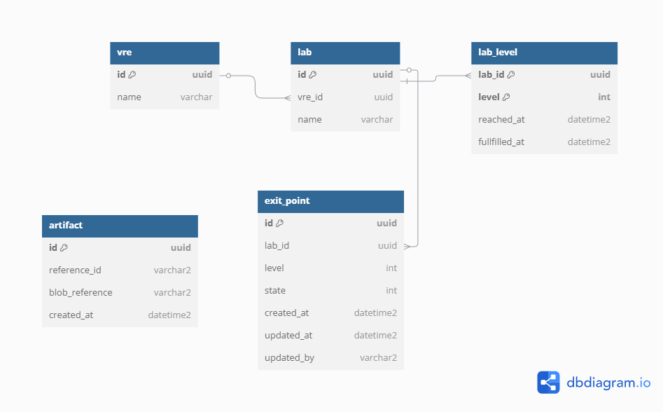
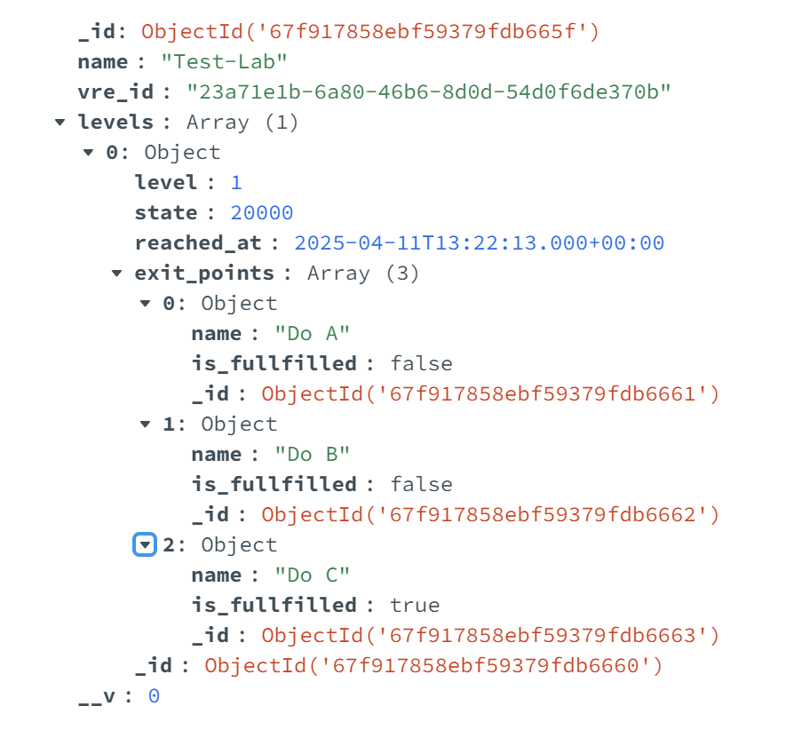
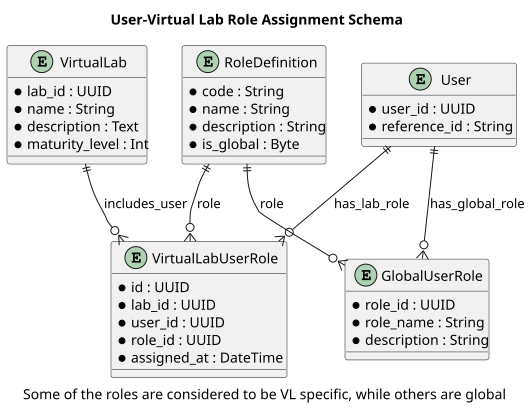
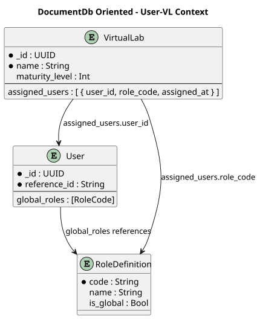
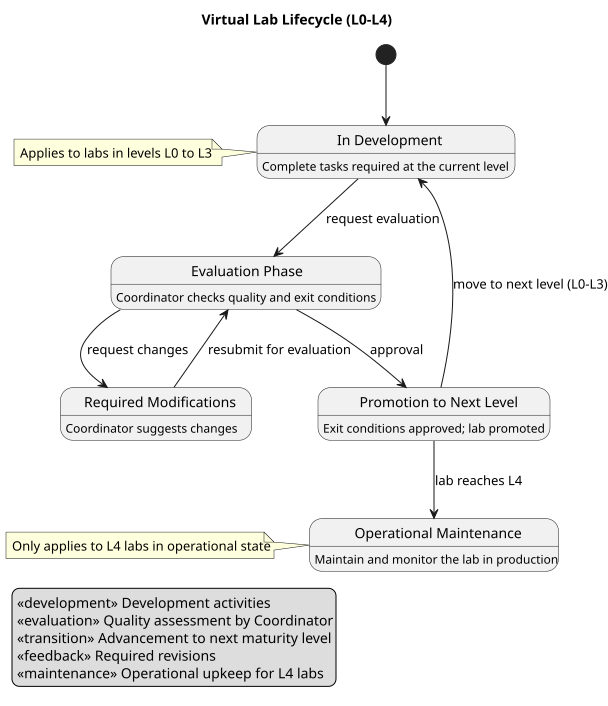
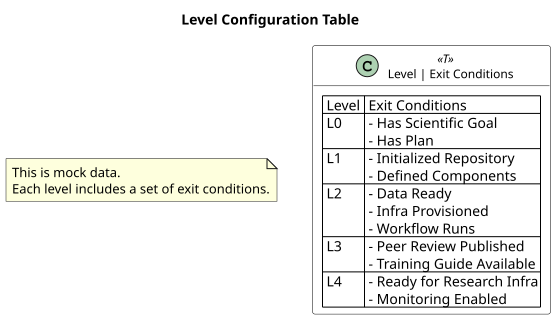
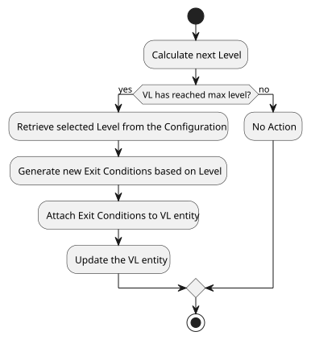
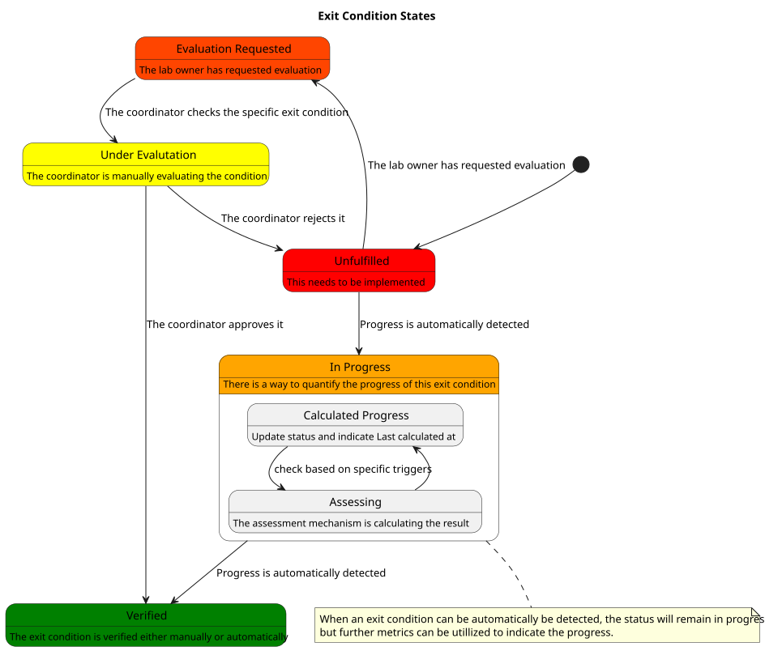
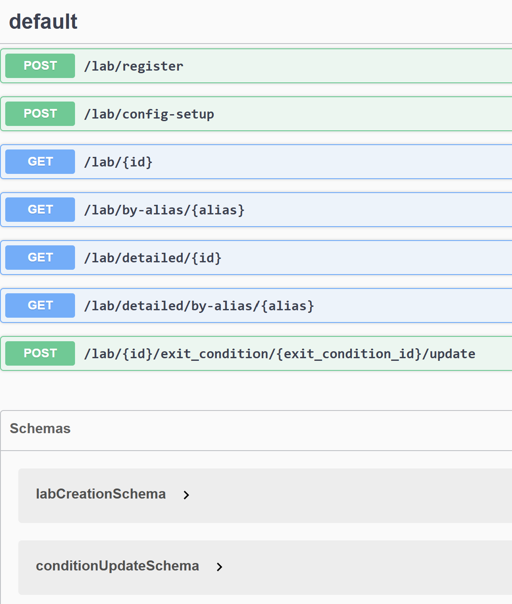

# Virtual Research Lab Repository
:sectnumlevels: 4
:toclevels: 4
:sectnums: 4
:toc: left
:icons: font
:toc-title: Table of contents

*Last modified* : {docdate} 

*Document status* :  DRAFT

## Introduction

The purpose of this document is to describe the basic features that the "Core" Service will include for the Virtual Research Lab Readiness Framework.

### Assumptions

.Assumptions
[cols="1e,6e,1e"]
|===
| ID | Detail | Status

| HA1
| Newly created labs will begin from Level 0 to experiment
| Unverified

| HA2
| The creation of a Virtual Lab is a manual Operation
| Unverified
|===

## General context

### Objectives

[TIP]
Virtual Research Labs (VRL) allows scientists to experiment with large datasets, and verify other experiments accordingly given the correctness of each Lab.
====
Each VRL has several quality properties that can act as conditions to signal the _maturity_ of each Lab.
====
====
https://naavre.net/[NaaVRE] is an implementation of a Virtual Research Lab, however without identifying the _maturity_ level of each lab.
====
====
The purpose of this service is to act as a repository which tracks the Labs and their corresponding _maturity_ or _readiness_ level.
====
====
Once a Virtual Research Lab is considered _mature_ enough, it can be used from other users for their own research.
====

### Actors

[TIP]
The main categories of users that will interact with the application

[cols="1e,4e,1e"]
|===
| Actor | Description | Organization 

| Component Developer
| Creates/Maintains Virtual Research Labs
| N/A

| Coordinator
| Technical Owner of the Lab, can push it to the next level
| ERiC (?)

| User
| Domain scientist using the Lab for their own Research
| N/A

|===

## Requirements

### Lab Registration
[cols="1e,6e,1e"]
|===
| ID | Detail | Status

| LR1
| A scientist can express their interest to create a new Virtual Lab in order to experiment with a new concept
| Unverified

| LR2
| The Lab creation request should include the purpose and the project timeline
| Unverified

| LR3
| The Request can be approved/declined by (undefined role?)
| Unverified
|===

### Lab Readiness Levels
[cols="1e,6e,1e"]
|===
| ID | Detail | Status

| LRR1
| Each VRL should maintain the current _readiness_ level
| Unverified

| LRR2
| For each _readiness_ level, the exit conditions should have their own state to define whether they are satisfied or not
| Unverified

| LRR3
| All the modifications regarding the readiness levels and the exit conditions, should be saved for historic purposes
| Unverified

| LRR4
| Each _readiness_ level corresponds to a configuration of basic exit conditions 
| Unverified

| LRR5
| Custom exit conditions may be added by the Coordinator 
| Unverified
|===

### Interoperability

[cols="1e,6e,1e"]
|===
| ID | Detail | Status

| ORR1
| Access should be provided to external systems and update the _exit conditions_
| Unverified

|===

## Schema

### Proposed Models
#### Relational
This is an ER diagram that can be applied in a Relational Database.

#### Non Relational
This an (outdated) view of how the labs can be modelled in a document db.

## Role Management
### Access Management
Based on the https://github.com/NaaVRE/NaaVRE-architecture/tree/main[architecture], 
https://www.keycloak.org/[Keycloak] is used for Access Management. The following scopes need to be created to ensure that access is protected.

The distribution of this token can decised on a later stage.

[cols="e,2e"]
|===
| Scope | Description

| vl:create
| Propose or register a new virtual lab

| vl:review
| Approve/Deny exit conditions

|===

### Associated Roles
The management system associates specific roles with the lab usage. Some of the roles can be global across the VRE, and some are specific to the VL only. For scaling purposes we can consider the global ones.

TODO: Keep only the relevant roles for this service. Move all of them to a different point.

[cols="e,2e,e"]
|===
| Role | Code | Scope

| Golden User | VLGU | VRE-specific

| Component/Services Developer | SCD | VRE-specific

| Silver User | VLSU | VRE-specific

| Ivory User | VLIU | VRE-specific

| Virtual Lab Code Reviewer | VLCR | VRE-specific

| Scientific Steering Board | SSB | VRE-specific

| Coordinator | CO | Global

| Community Supporter | CS | Global

| Virtual Lab Trainer | TR | VRE-specific

| VRE DevOps Engineer | DO | Global

| VRE Researcher | VR | Global

| User Supporter | US | VRE-specific

| Infrastructure Supporter | IS | Global

|===

### Application Modeling
The previous roles indicate that each lab needs to persist information regarding its users and the role they hold in each lab. Additional roles can be saved as contributors or just visitors. It is valuable to keep this information of the role of the users so the usage can be verified at a later point. 

An access log can be also created to study the usage patterns. Another issue we must take care of is the possibility to change  the roles of each lab. The schema should support multiple roles and keep reference of the changes.

## Feature Mapping
This section describes the basic functionalities of this application.

### Overview
There are multiple functionalities described in this app. The main ones are described in detailed below. These features rely on the same datasets and they set the boundaries of this application.

.Main Features
* VL Creation Request
* VL Level and Exit Condition Management
* VL User Role Management

### Creation Request

====
This feature allows the scientists (golden users) to request the creation of a new VL lab for their own research.
====

#### Types of VL Creation
A new VL can either be a plain one or it can be a clone of an existing one, which will be modified for the needs of the research.

#### Roles
The user who request a new VL, will also be its golden user. The request has to be reviewed from a Coordinator 

### Level and Exit Condition Management
#### VL Levels
The link:https://naavre.net/docs/readiness_levels/[maturity or readiness ]of a Virtual Lab is described with one of the following Levels (L0, L1, L2, L3, L4) and it describes whether it is ready to be used across the scientific community. 

====
Each Level has a list of exit conditions that have to be satisfied, so the lab can move to the next level.
====

When the VL owner (the golden user) wants to move the lab to the next level, they must request an evaluation (from the coordinator). Depending on the quality, the coordinator can either request modifications or move the lab to the next level.

#### Exit Condition
This entity acts as an item in a check list, which shall be marked as completed, for the lab to move to the next stage.

#### Exit Condition Configuration
A configuration is created to save the exit conditions for each level. When a lab is promoted to a new level, this configuration is used to retrieve the exit conditions which are added to the VL entity.

Indicative Table:

Main algorithm:

This logic can be extended and more dimensions can be added to the configuration. This will apply different exit conditions for different labs, depending on their type or the research they are used for.

##### Status
This list of the statuses should describe an exit condition.

//TODO: Verify these
.Status
* Not Started
* In Progress
* Pending Review
* Under Discussion
* Verified

#### Automatic assessment
This app exposes endpoints to update the exit condition status. The automatic assessment of this project is part of a different app.

See more link:auto_assessment.adoc[here]

### User Role Management
#### User Role Relation
Explain where the current list comes from

#### Exposure to organizational changes
Explain why this mapping will probably change and why it needs to be easily configurable

## Proof Of Concept

In order to verify the correctness of this framework a proof of concept https://github.com/ikoko3/vre_maturity_level_management[application] is also being developed.

### Operational Endpoints
The endpoints are exposed over Swagger using the Open API 3.0 specification.

